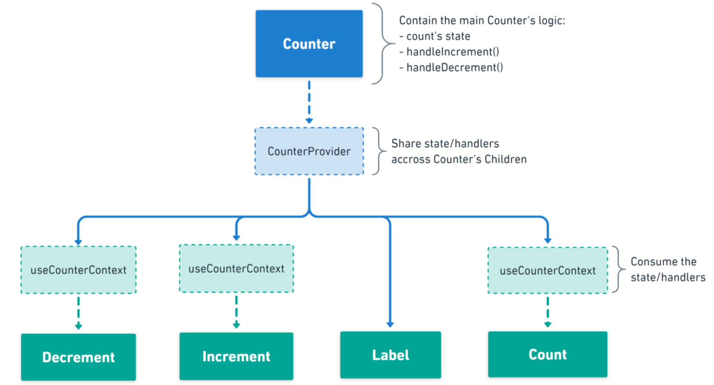
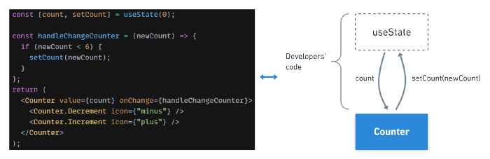
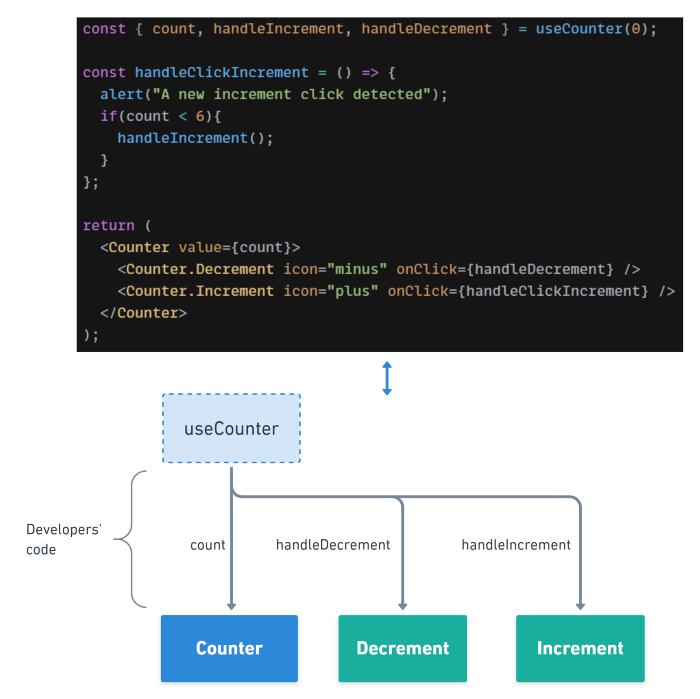
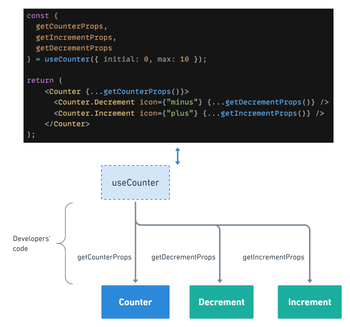
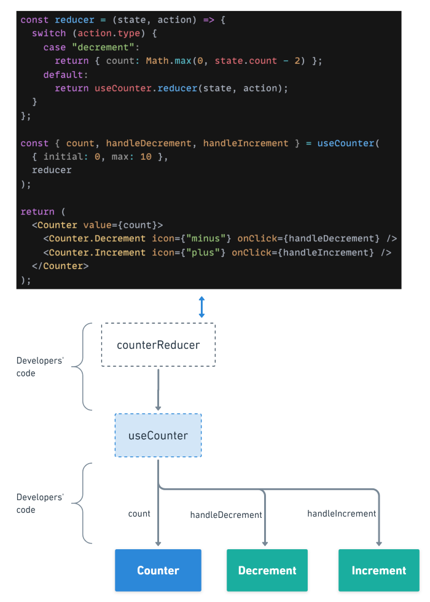

내가 개발을 하면서 가장 중요하게 여기는 점은 `재사용 가능한 컴포넌트, 확장 가능성, 효율성`이다.
그래서 내가 혼자 개발을 해도 누구든 확장을 가능할 수 있도록 설계를 하는 편이며, 필요하거나 가능하다면 재사용 가능한 컴포넌트를 개발하려고 노력하고 있다. 

이런 나름의 철학을 가지고서 개발을 하는편인데, 사실 이게 나만의 생각이지 누가 보면 내 설계에 의문을 가질 수도 있다. 

모두가 공감 가능한 개발을 목표로 하고 있기 때문에, 나 스스로도 개발 방향이나 철학을 점검하고 정리할 필요성을 느껴서 정리하는 글이다.

이 글은 IoC(Inversion of Control: 컴포넌트를 사용하는 유저에게 주는 유연성과 제어의 정도)에 관심을 둔 Pattern들이다. 

여기서 pattern을 설명할때 유저는 실제 고객이 아니라, 해당 패턴으로 개발을 했을 때, 해당 라이브러리를 사용하는 개발자를 의미한다. 

## Compound Componenets Pattern
불필요한 Prop drilling 없이 Expressive하고 Declaraticve한 컴포넌트를 만들 수 있는 Pattern
자식에게 prop을 전달하는데, 부모에 자식들이 깊어지면 계속에서 prop으로 전달을 해야한다. 이를 prop drilling이라고 한다.

이 패턴의 구조는 다음과 같다.



대부분의 로직은 Counter Component에서 관리하고, Context API를 통해서 states와 handlers를 자식 컴포넌트간에 공유한다.

```ts
import React from "react";
import { Counter } from "./Counter";

const Usage = (): JSX.Element (
  <Counter onChange={handleChangeCounter}>
    <Counter.Decrement icon="minus" />
    <Counter.Label>Counter</Counter.Label>
    <Counter.Count max={10} />
    <Counter.Increment icon="plus" />
  </Counter>
)
export { Usage };
```

### 장점
  1. API 복잡도가 낮다. 부모 컴포넌트에 모든 prop을 줘서 자식에게 전달하는 방법보다, 각각의 prop이 각각의 서브컴포넌트에 붙어있는 방법이 더 좋다.
### 단점
  1. UI의 자유도가 크다. 튼 자유도는 예상치 못한 행동을 유발할 수도 있다.
  2. JSX가 너무 무거워진다. 이 패턴은 JSX의 열 개수를 너무 늘릴 수 있다. 

### 사용하는 라이브러리
  - React Bootstrap
  - Reach UI

## Control Props Pattern
이 패턴은 컴포넌트를 controll component로 바꿔준다. 외부 상태는 SSOT로 사용되어, 유저가 커스텀 로직을 삽입할 수 있게한다. 

유저가 컴포넌트의 상태를 제어할 수 있는 Pattern이다.



```ts
import React, { useState } from "react";
import { Counter } from "./Counter";

const Usage = (): JSX.Elemnt =>  {
  const [count, setCount] = useState(0);

  const handleChangeCounter = (newCount) => {
    setCount(newCount);
  };

  return (
    <Counter value={count} onChange={handleChangeCounter}>
      <Counter.Decrement icon={"minus"} />
      <Counter.Label>Counter</Counter.Label>
      <Counter.Count max={10} />
      <Counter.Increment icon={"plus"} />
    </Counter>
  );
}

export { Usage };
```
### 장점
  1. 믾은 통제권을 유저에게 줄 수 있다. state가 밖으로 드러나있기 때문에 직접 컨드롤 할 수 있다. 
### 단점
  1. 사용하는 것이 조금 복잡하다. 위의 Compound Pattern은 JSX에 구현만 하면 사용 가능했지만, 이 패턴은 JSX, useState, handleChange를 모두 체크해야한다.
### 사용하는 라이브러리
  - Material UI

## Custom Hook Pattern
Custom hook을 이용해서 유저가 더 많은 통제권을 가져갈 수 있도록 해주는 패턴이다. 



```ts
import React from "react";
import { Counter } from "./Counter";
import { useCounter } from "./useCounter";

const Usage = (): JSX.Element =>  {
  const { count, handleIncrement, handleDecrement } = useCounter(0);
  const MAX_COUNT = 10;

  const handleClickIncrement = () => {
    if (count < MAX_COUNT) {
      handleIncrement();
    }
  };

  return (
    <>
      <Counter value={count}>
        <Counter.Decrement
          icon={"minus"}
          onClick={handleDecrement}
          disabled={count === 0}
        />
        <Counter.Label>Counter</Counter.Label>
        <Counter.Count />
        <Counter.Increment
          icon={"plus"}
          onClick={handleClickIncrement}
          disabled={count === MAX_COUNT}
        />
      </Counter>
      <button onClick={handleClickIncrement} disabled={count === MAX_COUNT}>
        Custom increment btn 1
      </button>
    </>
  );
}

export { Usage };
```

### 장점
  1. 더 믾은 통제권을 유저에게 줄 수 있다. hook과 JSX에 자신만의 로직을 줄 수 있다. 
### 단점
  1. 사용하는 것이 더 복잡하다. 렌더링과 로직이 분리되어 있고, 유저는 이를 연결해줘야 한다. 어쩧게 작동하는지도 알 필요가 있다. 
### 사용하는 라이브러리
  - React table
  - React hook form

## Props Getters Pattern
Custom hook이 많은 통제권을 줘서 자유도를 높여주기는 하지만, 그만큼 사용하기 어렵다.
Props Getters Pattern은 이런 복잡도를 조금 줄인다. native props를 노출하는 대신에, props getters의 목록을 제공한다. 



```ts
import React from "react";
import { Counter } from "./Counter";
import { useCounter } from "./useCounter";

const MAX_COUNT = 10;

const Usage = (): JSX.Element => {
  const {
    count,
    getCounterProps,
    getIncrementProps,
    getDecrementProps
  } = useCounter({
    initial: 0,
    max: MAX_COUNT
  });

  const handleBtn1Clicked = () => {
    console.log("btn 1 clicked");
  };

  return (
    <>
      <Counter {...getCounterProps()}>
        <Counter.Decrement icon={"minus"} {...getDecrementProps()} />
        <Counter.Label>Counter</Counter.Label>
        <Counter.Count />
        <Counter.Increment icon={"plus"} {...getIncrementProps()} />
      </Counter>
      <button {...getIncrementProps({ onClick: handleBtn1Clicked })}>
        Custom increment btn 1
      </button>
      <button {...getIncrementProps({ disabled: count > MAX_COUNT - 2 })}>
        Custom increment btn 2
      </button>
    </>
  );
}

export { Usage };
```

### 장점
  1. Custom hook을 통한 방법보단 사용하기 쉽다. 복잡한 부분은 가려져 있어서, 유저는 올바른 getter를 잘 사용하기만 된다. 
  2. 유저가 원한다면 props를 오버로드할 수 있어서 유연하다.
### 단점
  1. 로직이 보이지 않아서 마법을 쓰는 것처럼 보이도록 한다.
### 사용하는 라이브러리
  - React table
  - Downshift

## State reducer Pattern
redux를 사용하는 개발자라면 친숙할 수 있다. Custom hook과 비슷해보이지만, reducer, action을 이용해서 컴포넌트를 내부적으로 제어할 수 있는 더 발전된 방법을 제공한다.



```ts
import React from "react";
import { Counter } from "./Counter";
import { useCounter } from "./useCounter";

const MAX_COUNT = 10;
const Usage = ():JSX.Element => {
  const reducer = (state, action) => {
    switch (action.type) {
      case "decrement":
        return {
          count: Math.max(0, state.count - 2) 
        };
      default:
        return useCounter.reducer(state, action);
    }
  };

  const { count, handleDecrement, handleIncrement } = useCounter(
    { initial: 0, max: 10 },
    reducer
  );

  return (
    <>
      <Counter value={count}>
        <Counter.Decrement icon={"minus"} onClick={handleDecrement} />
        <Counter.Label>Counter</Counter.Label>
        <Counter.Count />
        <Counter.Increment icon={"plus"} onClick={handleIncrement} />
      </Counter>
      <button onClick={handleIncrement} disabled={count === MAX_COUNT}>
        Custom increment btn 1
      </button>
    </>
  );
```
*Custom hook Pattern에 적용했지만, Compound components Pattern에 적용할 수 있다.*

### 장점
  1. 더욱 많은 통제권을 준다. state reducer를 사용하기 때문에 유저에게 좋은 통제권을 넘겨줄 수 있다. 
  2. 유저가 원한다면 props를 오버로드할 수 있어서 유연하다.
### 단점
  1. 가장 복잡하다. 
  2. action이 바뀔 수 있기 때문에 내부 로직에 대한 깊은 이해가 필요하다. 
### 사용하는 라이브러리
  - Downshift

참고
https://velog.io/@dnr6054/유용한-리액트-패턴-5가지
https://javascript.plainenglish.io/5-advanced-react-patterns-a6b7624267a6
https://github.com/alex83130/advanced-react-patterns
