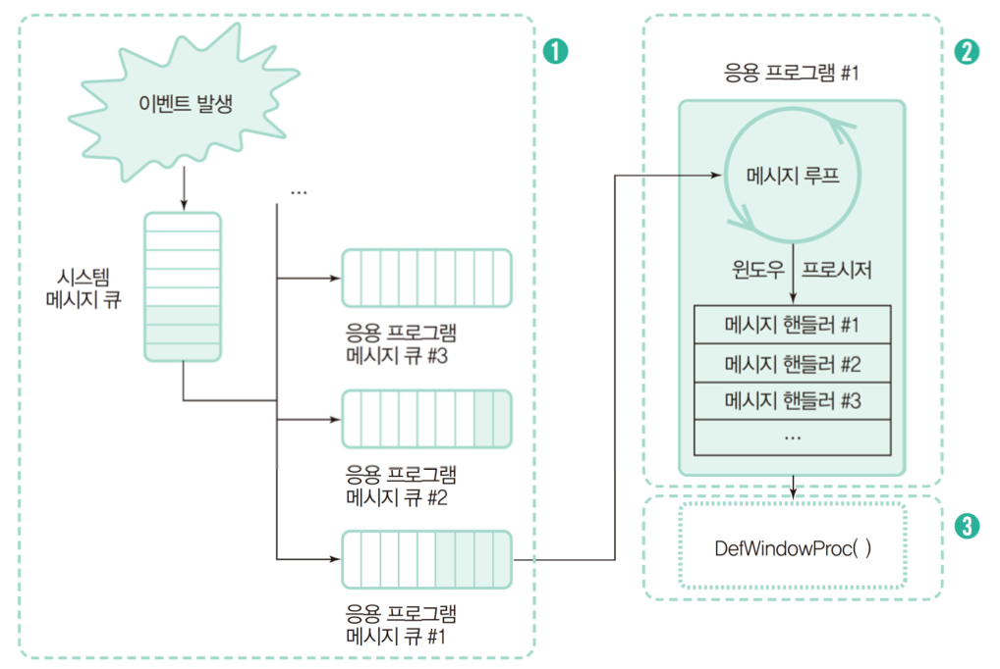

# Chapter 01 윈도우 프로그래밍 기초

## 윈도우 프로그래밍 개요
### 윈도우 운영체제의 특징
- 멀티태스킹: 운영체제가 여러 개의 응용 프로그램을 동시에 실행

- 멀티스레딩: 응용 프로그램 내부에서 여러 개의 실행을 동시에 진행

- API 호출문 집합: 윈도우 운영체제가 응용 프로그램을 위해 제공하는 각종 함수의 집합

- 메세지 핸들러 집합
  - 메세지 핸들러: 메세지를 받았을 대 동작을 결정하는 코드
- 윈도우 프로시저: 메세지 핸들러의 집합

- 실행 파일과 DLL 집합
  - DLL(Dynamic-Link Library): 프로그램 실행 중에 결합하여 사용할 수 있는 코드와 리소스 집합

- 장치 독립성
  - 주변 장치가 바뀌어도 장치 드라이버만 설치하면 프로그램을 수정하지 않고 실행할 수 있음
  - 응용 프로그램은 API를 통해 장치 드라이버와 간접적으로 통신하므로 장치 독립성을 가짐

### 윈도우 응용 프로그램의 개발 방식
- SDK(Software Development Kit)
  - 장점
    - API를 직접 다루기 때문에 세부 제어가 가능함
    - 윈도우 운영체제가 제공하는 모든 기능을 사용 가능
    - 생성 코드의 크기가 작고 속도도 빠름
  - 단점
    - 다른 개발 방식에 비해 생산성이 매우 낮음

- RAD(Rapid Application Development)
  - 장점
    - 직관적으로 간편하게 프로그래밍을 할 수 있음
    - 빠른 시간 내에 원하는 기능의 프로그램 개발 가능
  - 단점
    - SDk나 클래스 라이브러리를 이용한 개발 방식보다 생성 코드의 크기가 크고 실행 속도도 떨어지는 편
    - 윈도우 운영체제가 제공하는 모든 기능을 활용해 세부적으로 제어하기 어려운 경우도 있음

- 클래스 라이브러리(Class Library)
  - 장점
    - SDK를 이용한 방식보다 빠른 속도로 개발
    - API를 직접 사용해서 세부적으로 제어할 수 있음
    - RAD 개발 방식보다 코드 크기와 실행 속도 면에서 유리함
  - 단점
    - OOP에 익숙해야함
    - 러닝 커브가 큼

- .NET 프레임워크
  - 윈도우 운영체제에 설치할 수 있는 소프트웨어 개발 및 실행 환경

### SDK 프로그램 기본 구조
- SDK 프로그램 기본 골격
  - 윈도우 클래스를 정의하고 운영체제에 등록
  - 윈도우를 생성하고 화면에 나타냄
  - 메세지 루프를 구동함
  - 윈도우 프로시저에서 메세지를 처리함

#### SDK 프로그램 동작 원리

### MFC 프로그램 기본 구조
- 으용 프로그램 클래스 정의
- 메인 윈도우 클래스 정의
- 응영 프로그램 객체 선언
- 메세지 맵 선언

#### MFC 프로그램 동작 원리

## SDK 프로그램 기본 구조
## MFC 프로그램 기본 구조
## 비주얼 C++ 개발 환경